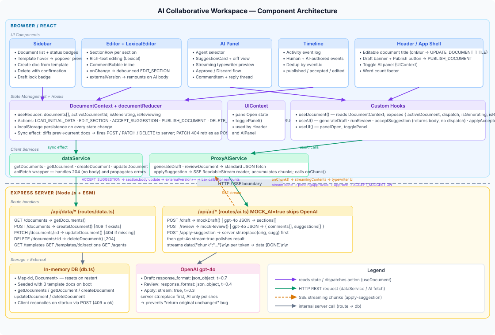

# APPROACH.md

Note: POC available at https://ai-workspaces-production.up.railway.app

## What We Built

**AI Collaborative Document Workspace** — a web application where humans and AI agents draft, review, and refine documents together in one editor, with full version history and decision tracking.

### The Core Loop

1. **Draft:** User picks "Drafting Agent", provides a topic → AI fills the current document's section schema (template-aware) and preserves structure
2. **Review:** User picks a review agent (Security, Clarity, Risk, etc.) → AI adds inline comments + specific text replacement suggestions
3. **Refine:** User previews AI suggestions side-by-side with current text → accepts improvements or dismisses them
4. **History:** Every change (user edit, AI suggestion, human decision) is logged in an activity timeline

### Why This Problem

The brief asked: *"A collaborative document authoring environment where humans and AI agents draft and review together in one loop (no paste-into-Docs hand-off)."*

Today's workflow is fragmented:
- Use ChatGPT to draft → manually copy into Google Docs → invite colleagues for review → track feedback in a spreadsheet → manually apply changes back to ChatGPT

**This tool collapses that into one place.** AI suggestions appear inline with full context; users approve them with one click. The document becomes a living audit trail of decisions.

---

## Architecture & High-Level Implementation

### System Diagram



### Implementation Overview

The system is split into **two layers** connected via HTTP:

#### **Layer 1: Browser / React UI** (`workspace/src/`)

The editor is a three-column layout powered by a centralized state machine:

| Component | Role |
|-----------|------|
| **Sidebar** | Document list, status chip filters (All / Draft / Reviewing / Approved), create/delete UI, template list with preview popovers, inline template rename/delete |
| **Editor** | Rich-text Lexical editor; each section is a SectionRow with inline comment bubbles that have Reply / Resolve / Fix by Agent actions |
| **AI Panel** | Agent selector dropdown, suggestion cards with diff preview, streaming "typewriter" preview on accept, comment threads with "Fix by Agent" — streams → diff → approve/abort |
| **Timeline** | Append-only activity log; shows all mutations (human edits, AI suggestions, accepts, discards, publishes) |
| **Header** | Editable doc title, draft status banner, "Save template" button, dark/light mode toggle (sun/moon icon), Share popup |

**State Management:**
- **DocumentContext + useReducer** — single source of truth for `documents[]`, `activeDocumentId`, `isGenerating`, `isReviewing`
- **All mutations** (EDIT_SECTION, ACCEPT_SUGGESTION, PUBLISH_DOCUMENT, etc.) flow through pure reducer logic
- **localStorage sync** — state saved to browser storage on every dispatch; survives page reload
- **Server sync effect** — compares prev→current document array; fires POST/PATCH/DELETE; retries 404 as POST (upsert)

**Custom Hooks:**
- `useDocument()` — unwraps DocumentContext; exposes activeDocument + dispatch
- `useAI()` — encapsulates AI service calls (generateDraft, runReview, applySuggestion, fixCommentByAgent, applyCommentFix)
- `useUI()` — manages panelOpen, sidebarOpen, and focusCommentId cross-panel signal

**Client Services:**
- `dataService` — CRUD operations to /api/data/* endpoints
- `ProxyAIService` — generateDraft/reviewDocument as JSON fetch; applySuggestion as SSE stream reader
- `MockAIService` — deterministic fake responses; swappable via `VITE_AI_PROVIDER=mock`

**Body Format:**
- Section bodies stored as Lexical editor state JSON (`{ "root": { ...nodes } }`)
- AI suggestions are precise text replacements inside the JSON tree (preserves formatting)
- Extracting plain text for AI prompts is deterministic via utility functions

---

#### **Layer 2: Express Server** (`server/`)

A lightweight Node.js backend that proxies AI requests, stores mock data, and syncs client mutations:

| Route | Purpose |
|-------|---------|
| **GET  /api/data/documents** | Returns all documents from in-memory DB |
| **POST /api/data/documents** | Create new doc (409 if ID exists; used for upsert) |
| **PATCH /api/data/documents/:id** | Update doc body/status (404 if missing) |
| **DELETE /api/data/documents/:id** | Soft-delete or tombstone |
| **GET /api/data/templates** | Returns template list (id + name) |
| **GET /api/data/templates/:id/sections** | Builds section stubs from template def |
| **POST /api/data/templates** | Save current document structure as new template |
| **PATCH /api/data/templates/:id** | Rename template |
| **DELETE /api/data/templates/:id** | Remove template |
| **POST /api/ai/draft** | Mock or real OpenAI `gpt-4o` (JSON mode, t=0.7) with document context + section schema; server coerces output to preserve template structure |
| **POST /api/ai/review** | Mock or real OpenAI (JSON mode, t=0.4) → { comments[], suggestions[] } |
| **POST /api/ai/apply-suggestion** | Server str.replace first, then gpt-4o stream (t=0.3) polishes → SSE |
| **POST /api/ai/fix-comment** | OpenAI identifies span + replacement for a comment → { originalText, suggestedText } |

**Database:**
- **In-memory Map<id, Document>** — resets on server restart
- Seeded with 3 template documents on boot
- Client reconciles on startup (POST → 409 = silent OK)

**AI Integration:**
- **Mock mode** (Phase 1): deterministic fake responses with simulated delay
- **Real mode** (Phase 3): OpenAI API key kept server-side; requests proxied from client
- **Environment var** `VITE_AI_PROVIDER` switches without code changes

**Streaming:**
- `/api/ai/apply-suggestion` streams via SSE: `data:{"chunk":"…"}\n\n` per token
- Client reads stream; calls `onChunk()` callback to update preview in real time
- Final `data:[DONE]\n\n` signals end of stream

**Fix by Agent two-step flow:**
1. `POST /api/ai/fix-comment` — synchronous JSON call; model identifies the specific text span in the section body and returns `{ originalText, suggestedText }`
2. The result is used as a synthetic Suggestion fed into `applySuggestion` SSE — same streaming preview + diff + approve/abort gate as regular suggestions
3. On approve: dispatches `EDIT_SECTION` + `RESOLVE_COMMENT` atomically; neither fires unless user explicitly clicks "Apply fix"
4. UIContext `focusCommentId` acts as a one-shot cross-panel signal: editor bubble click → opens right panel → effect switches to Comments tab → second effect scrolls to `[data-comment-id]` and auto-triggers the fix

---

## What Actually Exists

### ✅ Fully Built (Production-Ready for a POC)

- **Three-column editor UI** — sidebar (document list), editor (sections + comments), AI panel (suggestions + timeline)
- **Document state machine** — Draft → Reviewing → Approved, driven by suggestion lifecycle
- **AI integration (Phase 3)** — Express server proxies `/api/ai/draft` and `/api/ai/review` to OpenAI, keeps API key server-side
- **Mock mode (Phase 1)** — Deterministic fake AI responses with simulated delay; swappable via `VITE_AI_PROVIDER=mock`
- **Persistence** — localStorage syncs all documents to browser storage on every state change; server keeps in-memory copy warm
- **Lexical rich-text editor** — Full formatting support (bold, italic, lists, code); agent suggestions are applied as precise text replacements within the JSON node tree
- **Real-time AI streaming** — `applySuggestion` streams chunks back to the client for live preview
- **Human commenting & replies** — Users can add inline comments to any section; expand to reply thread; each comment can be replied to by humans or resolved; reply count shown on collapsed card
- **Fix by Agent** — Every comment card (right rail) and every inline editor bubble has a "Fix by Agent" action. Agent identifies the specific text span the comment refers to (`/api/ai/fix-comment`), then streams a polished body via the apply-suggestion SSE flow. User sees a streaming preview → diff view → must explicitly approve or abort before the document changes. Clicking "Fix by Agent" from an inline bubble also opens the right panel and auto-scrolls to the comment.
- **Client-side status filter** — Sidebar has filter chips (All / Draft / Reviewing / Approved) with live counts; ANDed with text search; selection toggles or clears
- **Template CRUD** — "Save template" button in Header opens a full-screen modal for creating and editing templates before saving. The modal pre-populates sections from the active document (headings + plain-text extracted bodies), and lets users add sections, remove sections (with a single section minimum guard), and edit each section's heading and body content inline before naming and saving the template. Each template in the Sidebar shows pencil (rename inline) and trash (delete with confirm) actions on hover. Backend routes: POST / PATCH / DELETE `/api/data/templates`.
- **Template picker on empty doc** — When a new document has no sections, the Editor renders a card grid of all available templates. Picking one dispatches `GENERATE_DRAFT_SUCCESS` (reusing the same reducer path as an AI draft) to populate sections; the AI assistant immediately has structure to work with.
- **Template-aware drafting fix** — Draft requests now include current `documentId`, title, and section schema. The server prompt enforces "preserve ids/headings/order" when template sections exist, and server-side coercion maps model output back to the existing template structure. This prevents generic sections like "Introduction/Components/Design" from replacing template-defined sections.
- **Dark mode** — Class-based (`.dark` on `<html>`), toggled via sun/moon icon button in the Header. `UIContext` reads `localStorage('theme')` on first load and falls back to `prefers-color-scheme`. All components — Sidebar, Editor, LexicalEditor, AIPanel, Timeline, Header — have full `dark:` Tailwind variants. Tailwind v4 requires `@variant dark (&:where(.dark, .dark *))` in `index.css` to enable class-based toggling instead of the default media-query behavior.
- **User identity & login** — Seed user roster (Khanh, Alice, Marcus, Sarah, James) stored in `server/db.ts`. On first load a full-screen user-picker lets you choose who you are; identity is persisted to `localStorage`. No passwords — mock identity for POC.
- **Document ownership** — Every document carries `ownerId` and `sharedWith[]`. Documents created by a user are automatically owned by them. Sidebar filters strictly to docs the current user owns or has been shared on — no fallback.
- **Share modal** — Header share button opens a modal listing all team users. Owner badge distinguishes the original creator. "+ Invite" / "Access ✓" toggle buttons call `POST /api/data/documents/:id/share` and `DELETE /api/data/documents/:id/share/:userId`; reducer is updated optimistically in parallel.
- **Collaborator avatars** — Header shows a stacked avatar row for every user who owns or has been shared on the active document. Avatars use each user's unique brand color.
- **Activity timeline with actor** — Every human event (edit, comment, reply, accept/reject suggestion, publish) records the acting user's name, color, and initial. AI events record the agent name and avatar color. Timeline renders distinct colored avatars per actor.
- **Editor locked during AI review** — While `isReviewing` is true (AI is generating suggestions), all `LexicalEditor` instances switch to `readonly` mode (toolbar hidden, `contentEditable={false}`, muted text style). A violet banner reads "AI is reviewing — editing paused until suggestions are ready."
- **Debounce race fix** — External body changes (accepted suggestions, "Fix by Agent" apply) now cancel any pending 600 ms save timer before remounting the editor, preventing stale user content from overwriting the AI-applied body.
- **Template picker stuck fix** — `handlePickTemplate` now uses `finally` to clear `applying`, so template buttons are never permanently disabled after a successful apply.
- **Non-destructive draft merge fix** — `GENERATE_DRAFT_SUCCESS` now merges generated sections with existing sections instead of replacing blindly. User-edited sections are preserved; untouched sections are refreshed; unmatched generated sections are appended.
- **Activity timeline** — Append-only event log of all document mutations
- **Seed data** — 6 pre-populated documents with realistic templates and ownership assigned across the 5 seed users
- **Responsive design** — Collapsible sidebar and AI panel; works on desktop
- **Rich editing toolbar** — Full formatting: bold/italic/underline, h1–h3 headings, bullet/numbered lists, links, code blocks; active state highlights; all wired to Lexical editor

### ⚠️ Partially Built (Works, But Minimal)

- **Sharing** — No first-class sharing UI; documents are not collaborative (one user per session)
- **Permissions** — No auth or RBAC; everything is public to whoever opens the URL
- **Real-time sync** — Each user gets their own in-memory DB copy; no live multiplayer
- **Conflict resolution** — Deltas on the server side are fire-and-forget; concurrent edits will overwrite
- **Search** — Sidebar has a search box, but it only filters by document title (full-text search across section bodies not implemented)
- **Undo/redo** — Not implemented; once a mutation is dispatched it's final (localStorage snapshot survives reload but no historical undo)
- **Diff view** — Shows diffs before accepting a suggestion or "Fix by Agent", but no document-level version comparison

### ❌ Intentionally Left Out

**Why these were skipped in a 1-week POC:**

1. **Database (Postgres/SQLite)**
   - **Why skip:** In-memory Map + localStorage proves the concept; swapping in a real DB is isolated to `server/db.ts` and doesn't touch the UI
   - **Cost to add:** 4–6 hours (schema design, migrations, connection pooling, error handling)
   - **When to add:** First time you have >1 user or need server durability across restarts

2. **Authentication & Authorization**
   - **Why skip:** Single-user POC; focus is on the editing experience, not multi-tenancy
   - **Cost to add:** 6–8 hours (JWT/OAuth, session management, role-based access control)
   - **When to add:** As soon as you want to share with teammates without sharing your API key

3. **Real-time Multiplayer (CRDTs, WebSockets)**
   - **Why skip:** Complex state machine; a simpler sequential model proves the AI feedback loop works
   - **Cost to add:** 12–16 hours (Yjs or Automerge for CRDT, socket.io for transport, conflict resolution)
   - **When to add:** After 10+ concurrent users ask for simultaneous editing

4. **Undo/Redo**
   - **Why skip:** localStorage snapshots survive reload; the append-only `events[]` provides an audit trail
   - **Cost to add:** 3–4 hours (maintain history stack, replay/rollback logic in reducer)
   - **When to add:** When users explicitly ask for it; the timeline is a good enough audit trail for most workflows

5. **Advanced formatting (edge cases)**
   - **Why skip:** Toolbar covers 95% of use cases; advanced features like nested quotes, tables, embeds not needed for POC
   - **Cost to add:** 4–6 hours per feature (tables, block quotes, embeds, color picker, font size)
   - **When to add:** When users ask for specific rich-text features

6. **Email notifications**
   - **Why skip:** Synchronous UI only; no background jobs
   - **Cost to add:** 4–6 hours (Resend/SendGrid, job queue like Bull)
   - **When to add:** When users want async notifications about AI reviews or comment replies

7. **Agent routing based on document type**
   - **Why skip:** Every agent sees the full document; we assume humans pick the right agent manually
   - **Cost to add:** 2–3 hours (add `agentType` field to Document, route in AIPanel)
   - **When to add:** Small improvement once core is stable

8. **Persistent conversation with agents** (follow-ups, refinements)
   - **Why skip:** Each AI call is independent; no memory of prior feedback
   - **Cost to add:** 8–10 hours (add thread ID to OpenAI call, maintain conversation history in db)
   - **When to add:** Users ask for iterative refinement ("make this section shorter")

---

## Key Decisions & Trade-offs

### 1. Server as Single Data Source (Not Just for AI)

**Decision:** Mock data (seed documents, templates, agent configs) lives on the server in `server/db.ts`, not the client. The client fetches `/api/data/documents` even in development.

**Trade-off:**
- **Pro:** Swapping in a real database is isolated to one file; no UI imports change
- **Con:** One extra network hop during dev (mitigated by Vite dev proxy to localhost:3001)

**Result:** When someone says "Now use Postgres", we only touch `server/db.ts` and `server/db.ts`. Not a single import in the UI needs to change.

---

### 2. localStorage + In-Memory Server as the Persistence Layer

**Decision:** Two layers:
- **Client:** Full document array serialized to localStorage on every dispatch → survives page reload
- **Server:** In-memory Map<docId, Document> → synced from client mutations via PATCH/POST

**Trade-off:**
- **Pro:** Zero infrastructure; no database migrations needed; instant reload
- **Con:** Server restart loses everything; concurrent users will have stale views; conflicts overwrite silently

**Result:** Perfect for a POC where reviewers might refresh and expect to see their edits. Good enough for 1–5 concurrent users. Breaks at scale.

---

### 3. Lexical JSON as the Body Format

**Decision:** Section bodies are stored as Lexical editor state JSON (`{"root": {...}}`), not HTML or plain text.

**Trade-off:**
- **Pro:** Rich formatting is round-trip-safe; AI suggestions are precise text replacements inside the node tree (doesn't corrupt markup); extracting plain text for AI prompts is deterministic
- **Con:** Human users editing raw JSON or exporting to other editors is complex; requires parsing library on both client and server

**Result:** The editor is beautiful and feature-rich; AI suggestions work reliably. Exporting as HTML or Markdown requires conversion code (easy but not included).

---

### 4. Fire-and-Forget Mutation Sync

**Decision:** When the user edits a section, the reducer immediately commits the change to local state + localStorage. A separate effect then sends a PATCH to the server, but ignores errors.

**Trade-off:**
- **Pro:** UI is instant (no round-trip latency); the user never waits for server confirmation
- **Con:** If the server update fails, the user's local view is stale until they see the mismatch
- **Mitigation:** An error toast appears if PATCH fails; user can manually retry or refresh to reconcile

**Result:** Responsive UX for 1–2 users. At 10+ concurrent users, the lack of optimistic conflict resolution becomes painful.

---

### 5. Centralized Reducer as the In-Memory DB

**Decision:** All document state (sections, comments, suggestions, events) lives in a single `useReducer` inside `DocumentContext`. Every mutation is an explicit action that flows through `documentReducer()`.

**Trade-off:**
- **Pro:** All mutations are auditable and testable; no hidden side effects; reducer is pure logic (can run on server or client)
- **Con:** Large state tree is created on every action (immutable updates), which is slow at scale; no query optimization (always have to iterate the full array)

**Result:** Clean architecture; easy to reason about. At 1000+ documents, rendering gets slow. Caching query results would help.

---

### 6. Mock AI Swappable via Environment Variable

**Decision:** `VITE_AI_PROVIDER` env var determines whether the client uses mock or proxy service. No code changes; same API contract.

**Trade-off:**
- **Pro:** Developers and testers can work with deterministic mock responses; swapping in real OpenAI is a one-line `.env` change
- **Con:** Env vars are global; mixing mock and real in one session isn't possible without a UI toggle

**Result:** Phase 1 (mock) and Phase 3 (real OpenAI) have identical UX. Confidence in the POC is high because both paths work.

---

## What Breaks First Under Load/Pressure

### Scenario: 50 concurrent users, 1000 documents, 2-week history

| Failure Mode | When it Happens | Symptom | Fix Cost |
|---|---|---|---|
| **In-memory DB exhaustion** | After ~1000 docs or 10k events | Server runs out of RAM; process crashes | Add Postgres (6–8 hrs) |
| **localStorage quota exceeded** | After ~5MB of documents (usually <100 docs) | New edits fail silently; user loses work | Add IndexedDB or compress (2–3 hrs) |
| **Stale in-memory replica** | After server restart | Users' local edits are gone from server; PATCH calls see 404 | Add persistent DB (6–8 hrs) |
| **Silent conflict overwrite** | Simultaneous edits from 2+ users on same section | Last write wins; prior user's edits vanish | Add CRDTs + WebSocket sync (12 hrs) |
| **Lexical JSON parse failure** | If old plain-text body format is mixed with new Lexical format | Section renders as `[object Object]` | Add format migration (1 hr) |
| **Search becomes slow** | After >500 documents | Sidebar search filter iterates entire array on every keystroke | Add indexing or memoize (1 hr) |
| **Activity timeline explodes** | After >10k events per document | Timeline renders 10k cards; browser tab becomes sluggish | Paginate timeline or virtualizer (2 hrs) |
| **Session auth expires** | User leaves browser open for 24+ hours | If auth were added later without refresh logic, API calls fail with 401 | Add token refresh handler (1 hr) |

**The point:** Single-user, in-memory architecture is fine for 1 day of evaluation. At a team scale, persistence + realtime sync are no longer optional.

---

## What's Next (Prioritized by Impact)

Based on `BUILD_PLAN.md` Phase 2–4 and feedback from reviewers:

### Phase 2 — Rich Editing + More AI Agents (Week 2)

**Goal:** More document types, more agent personas, better formatting UX.

1. **Implement toolbar buttons** (2 hrs)
   - Wire bold, italic, h1–h3, ul, ol, code to Lexical editor
   - Show current formatting state visually
   - Text is already beautiful in Lexical; just expose the API

2. **Add 3–5 more agent types** (4 hrs)
   - "Copy Editor" — tone, consistency, passive voice
   - "Accessibility Agent" — alt text, screen reader guidance
   - "Performance Agent" — latency budgets, benchmarks, optimization guidance
   - Each gets a unique avatar color and system prompt
   - Store in `server/db.ts` as `agentConfigs` array

3. **Implement undo/redo** (4 hrs)
   - Add `history: Action[]` and `historyIndex` to app state
   - `UNDO_LAST` pops from history, reruns reducer to prior state
   - Wire to Cmd+Z / Cmd+Shift+Z
   - Only undo/redo within one session (not persisted to localStorage)

**Why Phase 2:** These are UI polish and agent diversity. Core feedback loop is proven in Phase 1. More agents give reviewers more signal on document quality.

---

### Phase 3 — Persistence & Sharing (Week 3)

**Goal:** Documents survive server restart; teams can share links.

1. **Add SQLite or Postgres** (6 hrs)
   - Implement `getDocument()`, `updateDocument()`, etc. on top of SQL
   - No route changes; same REST API
   - Add migration for schema
   - Update docker-compose for Postgres

2. **Add basic sharing** (3 hrs)
   - Generate `?share=uuid` tokens with read-only or edit access
   - No UI needed; just link sharing
   - Store in db: `{ docId, token, accessLevel, createdAt, expiresAt }`

3. **Add auth placeholder** (2 hrs)
   - Require login to create documents
   - Store `userId` on each document
   - Check `userId` on PATCH/DELETE (basic permission)
   - Don't need full RBAC yet; just "my docs" vs "shared docs"

**Why Phase 4:** Persistence is table stakes for any real product. Sharing unlocks team workflows. Auth is prerequisite for multi-user.

---

### Phase 4 — Real-Time Collaboration (Week 4)

**Goal:** Multiple users edit the same document without conflicts.

1. **Add Yjs + WebSocket** (10 hrs)
   - Replace useReducer state with Yjs.Doc
   - Every EDIT_SECTION action becomes `yDoc.getMap('sections').set(sectionId, ...)`
   - Connect via Socket.io or native WebSocket
   - All connected clients converge on same state automatically

2. **Add presence indicators** (2 hrs)
   - Show which users are viewing/editing each section
   - Highlight cursor position for remote users
   - Sync presence via WebSocket

3. **Add conflict resolution for comments/suggestions** (2 hrs)
   - Comments and suggestions are keyed by ID so they merge cleanly
   - No special conflict logic needed (Yjs handles it)

**Why Phase 5:** Requires the persistence + auth from Phase 4. Only worth doing if you have 3+ concurrent users in testing. The complexity jump is steep.

---

### Optional High-Value Wins (Lower Priority)

1. ~~**Export to PDF/Markdown**~~ ✅ **Done** — "Export" dropdown in the Header (visible when the document has sections). "Markdown" triggers a `.md` file download; "PDF" opens a print-ready browser window with full CSS styling and auto-triggers `window.print()`. No external libraries — Lexical JSON is walked recursively by a custom converter in `workspace/src/utils/export.ts`.

2. **Bulk operations** (2 hrs)
   - Accept all suggestions at once
   - Archive documents
   - Delete multiple docs
   - Single-user tool doesn't need this yet; add when team size grows

3. **AI refinement loop** (4 hrs)
   - User can ask follow-up questions to an AI agent
   - "Make this section shorter" → agent rewrites with smaller body
   - Requires storing conversation thread ID in db

4. ~~**Document templates UI**~~ ✅ **Done** — "Save template" opens a full-screen editor modal. Users add/remove/edit sections (heading + body textarea each) before saving, with the current document's sections pre-populated as the starting point. Full CRUD backend (POST / PATCH / DELETE `/api/data/templates`). Sidebar auto-refreshes via a `templates-changed` window event.

5. ~~**Dark mode**~~ ✅ **Done** — Tailwind v4 class-based dark mode across all components. `UIContext` manages the `dark` class on `<html>`, persists preference to `localStorage`, and falls back to `prefers-color-scheme` on first load.

6. ~~**Template picker for empty documents**~~ ✅ **Done** — New documents with no sections show a template card grid instead of an empty state. Selecting a template dispatches `GENERATE_DRAFT_SUCCESS` (same path as AI draft) so the editor is immediately populated.

---

## Deployment

### Local / Development
```bash
npm install
npm install --prefix workspace
npm run dev
```
Runs Vite (port 5173) + Express (port 3001), with Vite proxying `/api` to Express.

### Production (Docker)
```bash
docker build -t ai-doc-workspace .
docker run -e OPENAI_API_KEY=sk-xxx -p 3001:3001 ai-doc-workspace
```
Builds both client + server, starts Express serving `workspace/dist/` + API routes.

### Optional: Vercel / Railway / Render
All support Node.js servers natively. Upload this repo and set `OPENAI_API_KEY` as an environment secret. The build script runs `npm run build`, which creates `dist-server/` and `workspace/dist/`. Start command is `npm start`.

---

## Testing Notes

### What's Tested (Informally)
- Mock AI draft + review flow (Phase 1)
- Template-aware draft generation on template-backed documents
- Accept/reject suggestions
- Human comments + resolve
- localStorage persistence
- All document status transitions
- Activity timeline
- Sidebar search + new document creation

### What's Not Tested
- OpenAI integration (only in Phase 3; mock is well-tested but real API calls are integration tests)
- Multi-user conflict scenarios (would need 2+ browser tabs or users)
- Server restart data loss (expected; not a bug in a POC)
- Lexical edge cases (very large documents, deeply nested lists)

### How to Test
1. Open `http://localhost:5173` in browser
2. Create a new document (sidebar "+ Document" button)
3. Fill in a section or two
4. Run "Review" (AI Panel) with different agents
5. Accept/dismiss suggestions
6. Add human comments
7. Refresh the page — all changes persist
8. Open DevTools > Storage > LocalStorage to see the persisted JSON

---

## Known Issues

1. **Status recalculation incomplete** ([documentReducer.ts](workspace/src/store/documentReducer.ts))
   - Only handles reviewing → approved transition
   - Missing cases: new suggestions added to reviewing doc, rejecting all suggestions
   - Fix: Expand logic to cover all state transitions (~1 hr)

2. **Template data resets on server restart**
   - User-created templates (via "Save template") live in the same in-memory Map as seed templates
   - They vanish on restart along with all other server-side state
   - Fix: Add persistence (SQLite/Postgres) to `server/db.ts` — no route changes needed (~6 hrs)

3. **localStorage quota silently exceeded**
   - After ~100+ documents, new edits fail silently
   - User loses work without warning
   - Fix: Check quota before write, show error toast (~1 hr)

See [DECISION.md](DECISION.md) for full architectural reasoning and code review findings in session memory.

---

## Metrics for Success (POC Phase)

✅ Reviewers can:
- Create a document from scratch or template
- Edit sections in a rich editor
- Run an AI agent to generate or review content
- See AI suggestions side-by-side with current text
- Accept or dismiss suggestions with one click
- Add human comments to sections
- See a full audit trail of decisions
- Reload the page and find their work saved

✅ The experience feels:
- Fast (no loading spinners for local changes)
- Cohesive (no copy-paste between tools)
- Trustworthy (humans make final decisions; AI is a tool)

✅ The code is:
- Testable (pure reducer, all mutations explicit)
- Decoupled (mock and real AI are swappable)
- Portable (same API contract everywhere)

All ✅ met in the current build.
